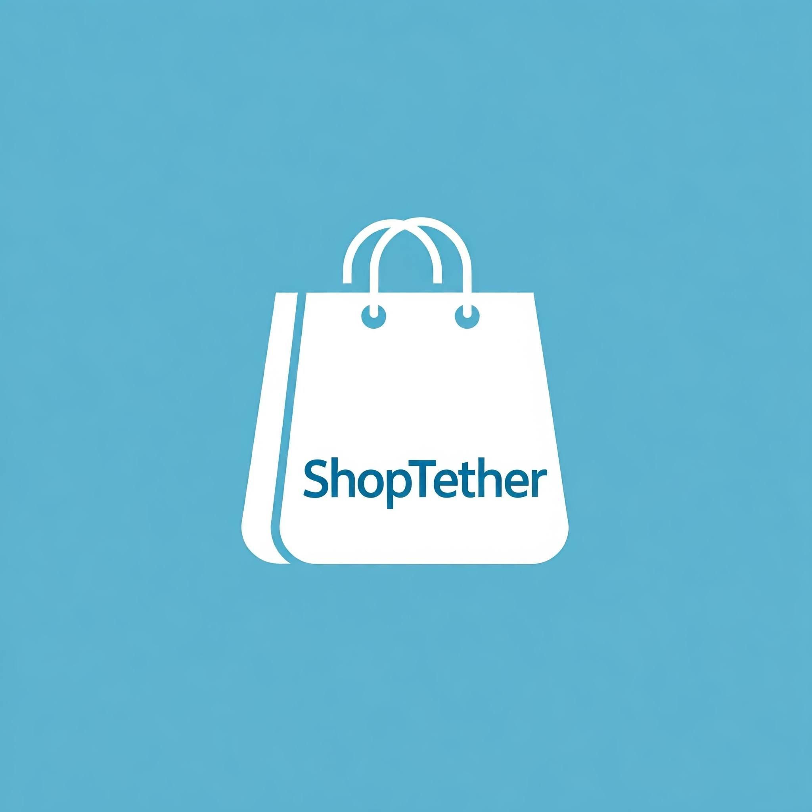

**ShopTether SDK**: 

Unlock seamless connectivity for your Shopify store with ShopTether, the open-source integration SDK designed for merchants looking to simplify their app ecosystem. Whether you want to connect with popular CRMs, email marketing platforms, or accounting tools, ShopTether makes it easy—no extensive coding required!

Key Features:
- **User-Friendly Interface**: Set up and manage integrations effortlessly with our intuitive dashboard.
- **Pre-Built Connectors**: Connect to widely-used applications like Mailchimp, Salesforce, QuickBooks, and more with ready-to-use modules.
- **Open Source**: Join a community-driven project that encourages collaboration and innovation. Contribute, customize, and enhance your integrations as needed.

Empower your Shopify store by integrating essential services and streamlining your operations. With ShopTether, focus on what matters most—growing your business!
